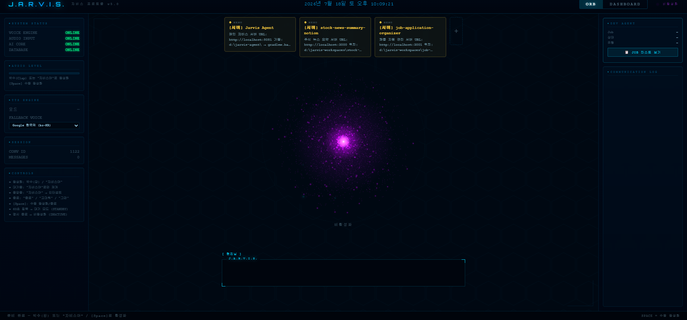

# 🤖 Jarvis AI 비서

Spring Boot와 Spring AI 기반의 지능형 AI 비서 애플리케이션입니다.
Claude(Opus/Sonnet/Haiku)와 로컬 Ollama를 요청 복잡도에 따라 자동 라우팅하여, 대화형 비서·코드 생성·브라우저 제어 등을 하나의 서버에서 제공합니다.

2026년 5월부터 약 2개월간 44개 커밋 · 기능 단위 브랜치/PR로 개발했습니다.



---

## 기술 스택

| 구분 | 기술 |
|------|------|
| **언어** | Java 21 |
| **프레임워크** | Spring Boot 3.4.5 |
| **AI 통합** | Spring AI 1.0.1 (Anthropic Claude, Ollama) |
| **데이터베이스** | H2 (파일 기반) |
| **빌드 도구** | Gradle (Kotlin DSL) |
| **아키텍처** | 헥사고날 아키텍처 |
| **부가 구성요소** | Chrome 확장(`extension/`), 로컬 음성 리스너(`jarvis-listener/`, Python) |

---

## 주요 기능

- **대화형 비서 (ChatController)** — Spring AI `ChatClient` + Tool Calling 기반 대화
- **AI 모델 자동 라우팅 (`ModelRouter`)** — 메시지 복잡도에 따라 Claude Opus/Sonnet/Haiku 또는 로컬 Ollama(`llama3.2:1b`) 중 자동 선택
- **AI 코드 생성 (AutoDev / DevJob)** — Claude CLI를 서브프로세스로 실행해 신규 프로젝트 스캐폴딩·기존 코드 수정 수행, 작업은 `DevJob`으로 비동기 추적
- **브라우저 제어** — `BrowserCommandController` / `BrowserTool` + Chrome 확장으로 브라우저 명령·YouTube 연동
- **음성 인터페이스** — `TtsController` + `jarvis-listener`(로컬 음성 인식) + 정적 UI(`static/index.html`, 오브 애니메이션)
- **할 일 / 메모 / 일정** — `TodoTool`, `MemoTool`, `ScheduleTool`을 통한 AI 도구 호출 기반 관리
- **실시간 알림** — `CardEventController`의 SSE 스트리밍
- **대화 요약** — `ConversationSummaryController`로 장기 대화 컨텍스트 압축
- **실행 서비스 조회** — `RunningServiceTool` / `RunningServiceController`

---

## 실행 방법

### 사전 요구 사항

- **Java 21** 이상
- **Gradle 8.x** (Wrapper 사용 권장)
- **Ollama** (로컬 잡담·경량 요청 처리용, [ollama.com](https://ollama.com) 참고) — `llama3.2:1b` 모델 필요
- **Anthropic API Key** (Claude Opus/Sonnet/Haiku 호출용)

### 빌드 및 실행

```bash
# 프로젝트 빌드
./gradlew build

# 애플리케이션 실행 (기본 포트 8081)
./gradlew bootRun
```

### API 키 및 환경 설정

`application-local.yml` 파일을 생성하여 설정합니다 (`.gitignore`에 포함됨):

```yaml
spring:
  ai:
    anthropic:
      api-key: sk-ant-your-api-key
    ollama:
      base-url: http://localhost:11434

app:
  project-root: d:/jarvis-agent
  workspace-root: d:/jarvis-workspaces
```

또는 환경 변수로 설정할 수 있습니다:

```bash
export ANTHROPIC_API_KEY=sk-ant-your-api-key
export OLLAMA_BASE_URL=http://localhost:11434
```

모델 ID 등 라우팅 관련 설정은 `application.yml`의 `jarvis.ai.model.*` 항목에서 관리합니다 (`opus`, `sonnet`, `haiku`, `ollama`).

---

## 프로젝트 구조

```
jarvis-agent/
├── build.gradle.kts          # Gradle 빌드 설정
├── settings.gradle.kts       # 프로젝트 설정
├── extension/                 # Chrome 확장 (브라우저 제어·YouTube 연동)
├── jarvis-listener/            # 로컬 음성 인식 리스너 (Python)
├── scripts/                    # 운영/루틴 PowerShell 스크립트
└── src/
    ├── main/
    │   ├── java/com/jarvis/
    │   │   ├── adapter/
    │   │   │   ├── in/web/     # Controller — 요청 위임만 수행
    │   │   │   └── out/        # DB(JPA)·AI(Spring AI) 어댑터
    │   │   ├── application/    # Service — 비즈니스 로직
    │   │   ├── domain/
    │   │   │   ├── model/      # 도메인 엔티티 (순수 POJO)
    │   │   │   └── port/       # in(UseCase) / out(Repository, AiModelPort) 인터페이스
    │   │   ├── tool/            # Spring AI @Tool 클래스
    │   │   └── config/         # 설정 클래스
    │   └── resources/
    │       ├── application.yml
    │       ├── prompts/         # AI 시스템 프롬프트
    │       └── static/          # 음성 UI (index.html, 오브 애니메이션 등)
    └── test/
        └── java/com/jarvis/
```

계층 간 의존 방향과 금지 패턴은 [.claude/rules/architecture.md](.claude/rules/architecture.md)를 참고하세요.

---

## AI 모델 라우팅

대화(`ChatService`)와 코드 생성(`DevJobService`) 경로는 각각 독립적으로 모델을 자동 선택합니다.

| 경로 | 판단 기준 | 선택 모델 |
|---|---|---|
| ChatService | 대규모/복잡 아키텍처 키워드 (MSA·풀스택·결제 등) | Claude Opus |
| ChatService | 인사말 등 도구·추론 불필요 잡담 | 로컬 Ollama (`llama3.2:1b`) |
| ChatService | 짧은 일반 요청 | Claude Haiku |
| ChatService | 그 외 기본값 | Claude Sonnet |
| DevJobService (NEW_PROJECT) | 복잡 아키텍처 키워드 | Claude Opus |
| DevJobService (NEW_PROJECT) | 일반 | Claude Sonnet |
| DevJobService (MODIFY_*) | 색상/폰트 등 단순 UI 수정 | Claude Haiku |
| DevJobService (MODIFY_*) | 그 외 기본값 | Claude Sonnet |

자세한 라우팅 규칙은 [.claude/rules/ai-routing.md](.claude/rules/ai-routing.md)를 참고하세요.

---

## 커스텀 Claude Code 커맨드

이 저장소는 Claude Code 작업을 위한 커스텀 커맨드를 제공합니다 (`.claude/commands/`).

- `/new-feature <Name>` — 전 계층 스캐폴딩 (Domain → Port → Service → Controller)
- `/add-tool <Name>` — Spring AI `@Tool` 추가
- `/run-server` — 서버 상태 확인 및 기동

---

## 라이선스

MIT License
